<p style="display: flex; flex-flow: column wrap; align-items: center; justify-content: center;">
  <h1 align="center">REBUS</h1>
  
  <span style="margin-top: 20px;"> &#128161 A Simple Game Project. </span>
</p>

<hr/>

# Contents

- [How to contribute](#How-to-Contribute)
  - [Fork this repository](#Fork-this-repository)
  - [Clone this repository](#Clone-this-repository)
    - [Clone this repository to Vscode](#Clone-this-repository-to-Vscode)
    - [Import from Github to Replit](#Import-from-Github-to-Replit)
  - [Make changes](#Make-changes)
  - [See your changes](#See-your-changes)
    - [Check changes on Vscode](#Check-changes-on-Vscode)
    - [Check changes on Replit](#Check-changes-on-Replit)
  - [Commit and Push changes to Github](#Commit-and-Push-changes-to-Github)
    - [Commit and Push from VScode](#Commit-and-Push-from-VScode)
    - [Commit and Push from Replit](#Commit-and-Push-from-Replit)
  - [Submit your changes for review](#Submit-your-changes-for-review)
- [Upcoming Features for this Rebus project](#Upcoming-Features-for-this-Rebus-project)

# How to Contribute

If you don't have git on your machine, [install it](https://help.github.com/articles/set-up-git/).

If you don't have Vscode, [install it](https://code.visualstudio.com/download).

## Fork this repository

Fork this repository by clicking on the fork button at the top of this page. This will create a copy of this repository in your account.


Then create fork


## Clone this repository

In this section, I will give full details on how to clone this repo on Vscode and Replit. You can choose any one between the two to contribute to this project.

### Clone this repository to Vscode

**Firstly, you have to create a personal token. click [here](https://docs.github.com/en/enterprise-server@3.4/authentication/keeping-your-account-and-data-secure/creating-a-personal-access-token) to create one and strictly follow the steps and instructions there.**

 _Skip to [Import from Github to Replit](#Import-from-Github-to-Replit)]_

Go to your Github account and open the forked repository, click on the `code` button then click the _copy to clipboard_ icon as shown below:


If successfully copied, you should get this:


Open your Vscode, click on `Terminal` section and click `new terminal` to open a terminal in Vscode or use `ctrl + f7` as shown below:

 

When it is opened, run the following git commands:

```
git clone https://{YOUR_PERSONAL_TOKEN}@github.com/{YOUR_USERNAME}/Rebus-Puzzles_webpage.git
```

:bulb: Replace {YOUR_PERSONAL_TOKEN} with the personal access token generated from the first step above. Replace {YOUR_USERNAME} with your github username as shown in the image below.

:bulb: right-click on the terminal to paste what you just copied.


If successful, you should get this;


### Import from Github to Replit

If you don't have replit account, create one [here](https://replit.com/signup).

If done with the creating and set-ups or already created, navigate to the `home` section and check under `My repls` section, click on the `create` button to create new repl as shown below:

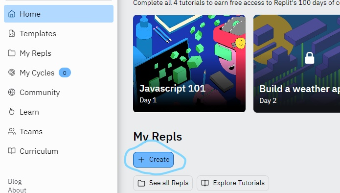

On the section that pops up, click on  `import from Github` button which is at the right top corner of the section as shown below:


Go to the tab of your cloned repository and copy the URL as shown below:


Then input the copied URL into the space labelled 1. in the pic below:

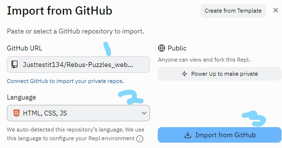

If the labelled (2) language detected is `Node.js`, change it to `HTML,CSS & JS` as shown above.

Then if you are done with the steps above, click on the button labelled (3) `Import from Github`.

Just wait for some seconds for everything to load onto the screen.

Boom!!! You've just imported the cloned repo from Github to Replit :grin:

## Make changes

### On Vscode

  _Skip to [Make changes on Replit](#On-Replit)_

  If terminal is still open, change directory to the new Rebus-Puzzles_webpage, using  this command:

  ```
  cd Rebus-Puzzles_webpage
  ```

  

  Then use this command to open the repository folder on Vscode.

  ```
  code .
  ```

  

  This will open a new window of Vscode with the Rebus cloned repo folder.

### On Replit

Just go ahead to the `Next step` below.

#### Next step

Now click on the src folder and open `Rebuses.jsx` file.

 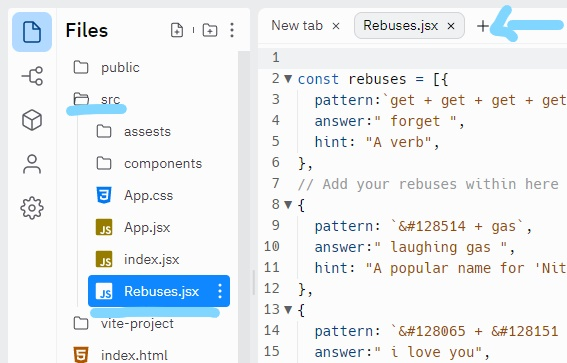

Add your own rebus to it. **Don't add it at the beginning or end of the file. Put it anywhere in between.** Using this format;

```
{
    pattern: ``,
    answer: ``,
    hint: ``,
},
```


:bulb: Those commas ',' in the format above are very important.

Note: In your rebus `pattern`;

-You can add some html tag to design your pattern.

-You can't add images.

-If you want to include emojis. You can get the full list of html emojis at [HTML Emojis](https://www.w3schools.com/charsets/ref_emoji.asp) then use them these ways;

  -- If you are using the `dec code` of your preferred emoji, write the `dec code` in this format into the pattern (`&#the-dec-code`)

  -- If you feel like using the `hex code`, write it in this format (`&#xthe-hex-code`)

Examples are provided in the `Rebuses.jsx` file.

## See your changes

### Check changes on Vscode

  _Skip to [Check changes on Replit](#Check-changes-on-Replit)_

If terminal is not open, Open the terminal then change directory to the cloned repo and run this command with internet connection:

```
npm install
```


Wait for the installation to finish. You should get something like this:


After the installation is successful, run this command:

```
npm run dev
```


then press `alt` on your keyboard and click on the `http://localhost:.../`


This will automatically open your browser and render the result on your screen in the browser's tab.

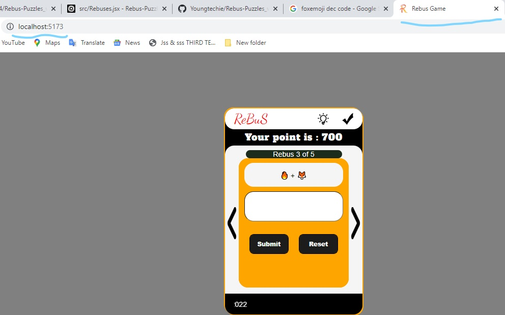

### Check changes on Replit

Click on the `shell` button at the right side section to run this command:

```
npm install
```


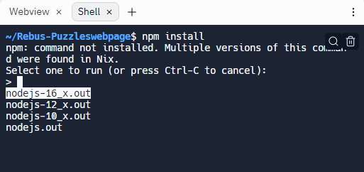

If you get the above suggestion;

Just press `Enter` on your keyboard to continue.


Wait for the installation to complete.

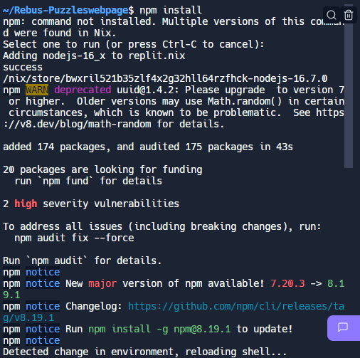

After the installation is successful as shown above, run this command:

```
npm run dev
```

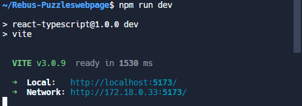

Then click on the `Webview` button, after some seconds you should see the webpage rendered to the screen there as shown below:

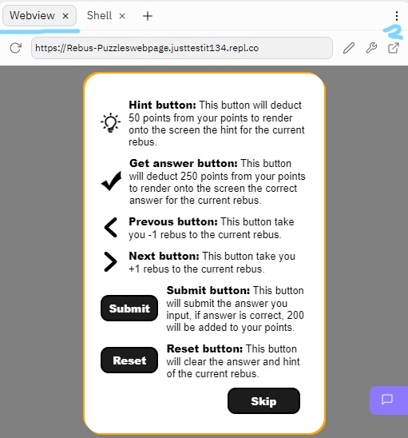

:bulb: You can click on the button labelled (2) to view in fullscreen.

Note: If you don't get the result after some minutes, go to the shell and click on the `http://localhost:.../` to show your result in a new tab in your browser.

## Commit and Push changes to Github

### Commit and Push from VScode

 _Skip to [Commit and Push from Replit](#Commit-and-Push-from-Replit)_

- Open a new terminal (ctrl + f7), change directory to the project directory and execute the two commands below, if you haven't done it before:

```
git config --global user.email "youremail@example.com"
```

example:


After that, execute this command also:

```
git config --global user.name "Your name"
```

example:


Successful? if yes, move to the next section below.

- Execute this command to see the file(s) you made changes in:

```
git status
```

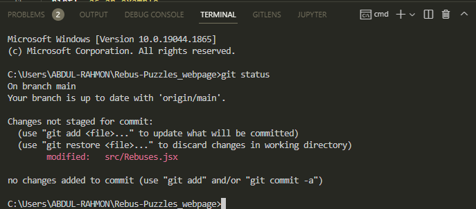

- Add those changes to your git branch using the `git add .` command:


- Now commit those changes using this command:

```
git commit -m "<your-name> added <number-of-rebus-you-added> rebus(es)"
```

Replacing `<your-name>` with your name and `<number-of-rebus-you-added>` with the number of rebus(es) you just added as shown below.


- Push your changes using the command:

```
git push
```


Boom!!!!! You have successfully pushed the changes to your cloned repo from Vscode. :grin:

### Commit and Push from Replit

To commit and push from Replit, follow the images and steps below:


Click on the button the arrow is pointing at, and fill in your commit into the field labelled (2), then click on the button `commit all & push` as labelled (3) in the image above.

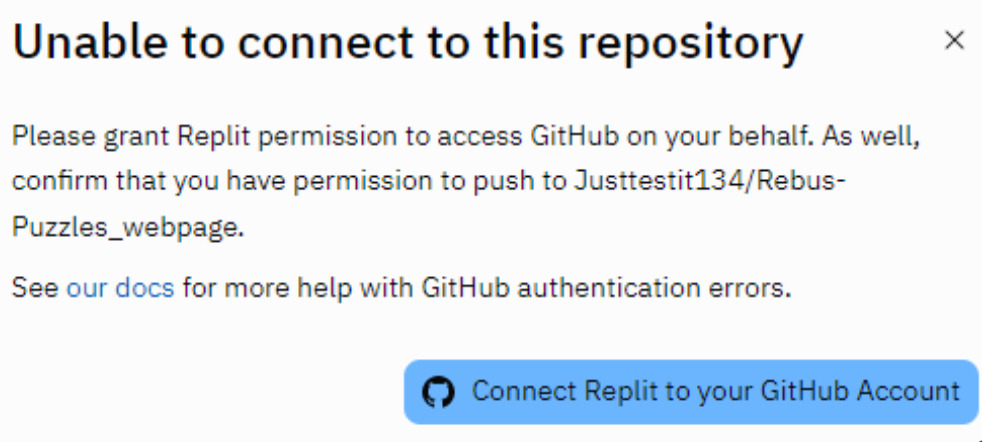

If the above pops up, click on the `connect replit to your github account`.

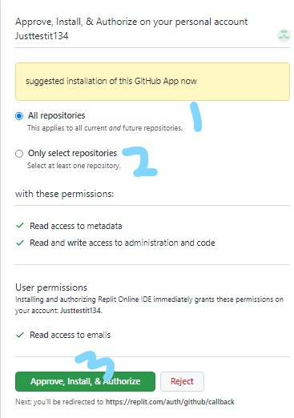

In the above image, you can choose to pick one out of the label (1) and (2).

then click on the label (3) to continue.

Next, you should see this:

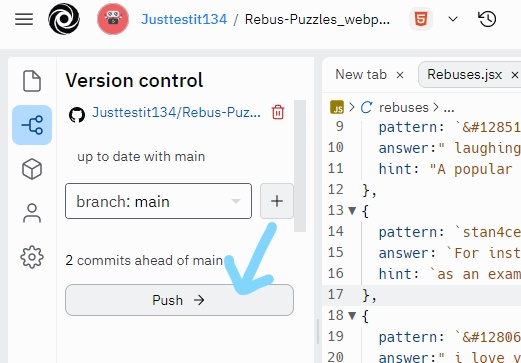

Click on the button labelled `push`

Then, you are done with the pushing if you get this:

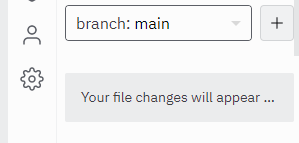

Booyah!!! :grin:

## Submit your changes for review

Now go back to the cloned repository on your Github account, you'll see the `Contribute` and `Sync fork` buttons as labelled 2 and 3 in the image below:


:bulb: A pull request (PR) is an event that takes place in software development when a contributor/developer is ready to begin the process of merging new code changes with the main project repository.

**This is important** -Before trying to send a PR(Pull Request) always click on the `sync fork` as labelled (3) in the image above because of the following:

1. There might have been some updates on the repository you want to send your PR, which you are notified as labelled (1) in the image above.
2. The PR you want to send might be for the changes another contributor as made and it has been merged.

So checking the updates, might save you the stress you should have gone through if not checked.

-Now, update your forked repository from the latest commit of the original Rebus-Puzzles_webpage repository if any update.


  -- After you have gotten the message:

  

- Then click on the `contribute` button to send a pull request.


Scroll down to see your changes.

For example:


Now to create the pull request. Input the title of your PR in the field labelled as (1) then click on the button labelled (2) to finally create your PR as shown below.

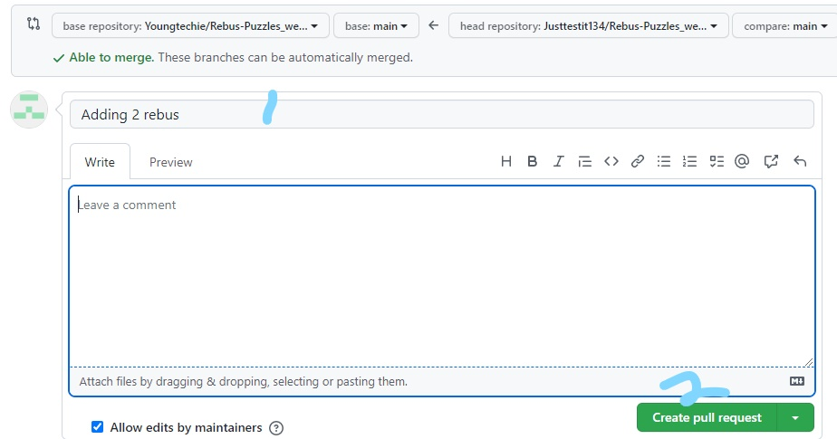

After the sending of the PR, You can also preview your changes by clicking:

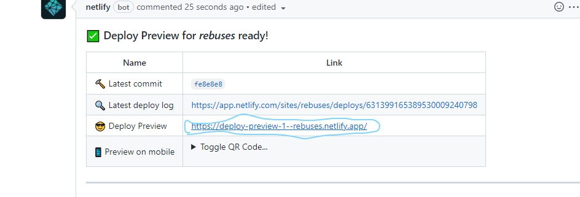

Soon I'll be merging all your changes into the main branch of this project. You will get a notification email once the changes have been merged.

Thank you for your contribution Champ :trophy: :relaxed:

# Upcoming Features for this Rebus project

- New UI for desktop view.
- Warning when hint or get answer button is click with insufficient point.
- Input your name before starting the game.

:bulb: You can also send in the feature(s) you think I should add by emailing youngtechie0@gmail.com. Thank you :kissing_heart: